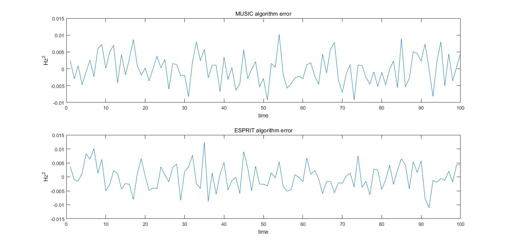
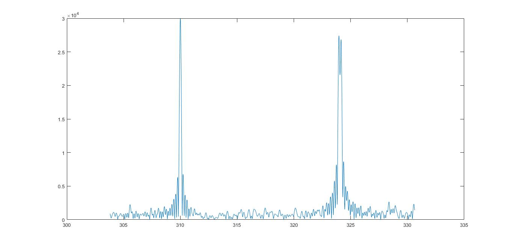
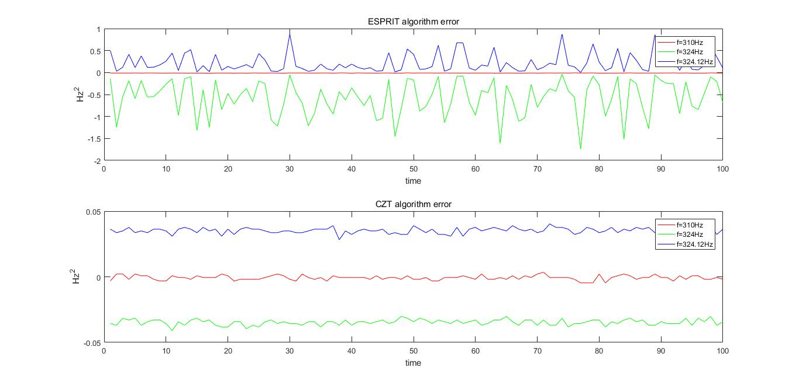

# DSP 大作业——频率测量实验报告

###### 无\\(42\\) 陈誉博 \\(2014011058\\)

## 1. 背景

频率测量是信号处理领域的基本问题。假设信号中含有\\(P\\)个单频信号分量，以及加性噪声。此时信号模型可以写作:
$$
r(t)=\sum_{p=1}^{P}a_p e^{-j2\pi f_pt}+n(t)
\tag{1.1}
$$
其中，$a_p$,$f_p$为第$p$个频率分量的幅度、频率。\\(n(t)\\)为加性复高斯白噪声（实虚部独立同分布）。采样满足Nyquist采样定理。

## 2. 问题

### 2.1 单频信号频率测量（\\(P=1\\)）

当\\(P=1\\)时，请描述你所能想到的频率测量方法，并用解析或/和数值的方法分析对比不同方法的估计精度（一定信噪比下，频率估计误差的均方值）。

### 2.2 多频信号频率测量（\\(P>1\\)）

当\\(P>1\\)时，请描述你所能想到的频率测量方法，并用解析或/和数值的方法分析该方法的估计精度和频率分辨力。

## 3. 单频信号频率测量（\\(P=1\\)）

### 3.0 信号的协方差矩阵模型

在此节中，我使用了一种新的信号模型。这个信号模型与\\((1)\\)中的模型不尽相同，但是\\((1)\\)中的模型可以看做此模型的一种特殊情况。我们定义新的模型如下：
$$
y(t)=x(t)+e(t) ; x(t)=\sum_{k=1}^n\alpha_k e^{i(\omega_kt+\phi_k)}
\tag{3.0.1}
$$
$x(t)\\)为不带噪声的复正弦信号，\\(\{\alpha_k\},\{\omega_k\},\{\phi_k\}\\)为分别信号幅度、角频率和初始相位\\(e(t)\\)为加性观测噪声，此处可以看做加性高斯噪声。此处我们假设初始相位为均匀分布在\\([-\pi,\pi]\\)上的独立随机变量。所以当\\(p=j\\)时有：
$$
E\{e^{i\phi_p}e^{-i\phi_j}\}=1
$$
当\\(p \neq j\\)时有：
$$
E\{e^{i\phi_p}e^{-i\phi_j}\}=E\{e^{i\phi_p}\}E\{e^{-i\phi_j}\}=[\frac{1}{2\pi}\int_{-\pi}^{\pi}e^{i\phi}d\phi] [\frac{1}{2\pi}\int_{-\pi}^{\pi}e^{-i\phi}d\phi]=0
$$

所以可以得到如下表达式：
$$
E\{e^{i\phi_p}e^{-i\phi_j}\}=\delta_{p,j}
\tag{3.0.2}
$$
令
$$
x_p(t)=\alpha_pe^{i(\omega_pt+\phi_p)}
\tag{3.0.3}
$$
为\\((2)\\)中的第\\(p\\)个单频正弦信号。则由\\((3)\\)可以得到如下两个表达式：
$$
E\{x_p(t)x_j^* (t-k)\}=\alpha_p^2e^{i\omega_pk}\delta_{p,j}
\tag{3.0.4}
$$
$$
r(k)=E\{y(t)y^* (t-k)\}=\sum_{p=1}^n \alpha_p^2e^{i\omega_pk}+\sigma^2\delta_{k,0}
\tag{3.0.5}
$$

定义如下两个记号：
$$
a(\omega)\triangleq[1,e^{-i\omega},\dots,e^{-i(m-1)\omega}]^T (m\times1)
\tag{3.0.6}
$$
$$
A=[a(\omega_1),\dots,a(\omega_n)] (m\times n)
\tag{3.0.7}
$$
其中\\(m\\)是一个为确定的整数（需要人为给定）。由于\\(A\\)是一个范德蒙矩阵，所以若\\(m\geqslant n\\)，且对于\\(k\ne p\\)有\\(\omega_k \ne \omega_p\\)，则\\(rank(A)=n\\)。所以由\\((1)\\)和\\((4)\\)可以得出如下描述符：
$$
\tilde{y}(t)\triangleq
\left[
\begin{matrix}
y(t) \\
y(t-1) \\
\vdots \\
y(t-m+1)
\end{matrix}
\right]
=A\tilde{x}(t)+\tilde{e}(t)
\tag{3.0.8}
$$
其中\\(\tilde{x}(t)=[x_1(t),\dots,x_n(t)]^T\\)，\\(\tilde{e}(t)=[e(t),\dots,e(t-m+1)]^T\\)。则信号的协方差矩阵可以写成如下形式：
$$
R\triangleq E\{\tilde{y}(t)\tilde{y}^* (t)\}=APA^H +\sigma^2I,P=
\left[
\begin{matrix}
\alpha_1^2 &  & 0 \\
 & \ddots & \\
 0 & & \alpha_n^2
\end{matrix}
\right]
\tag{3.0.9}
$$
在下一节中可以证明，\\(R\\)的特征空间包含了所有的频率信息。

### 3.1 算法

#### 3.1.1 MUSIC 算法

 MUSIC  算法使用了\\((3.0.9)\\)中的协方差矩阵模型\\((m>n)\\)。令\\(\lambda_1\geqslant\lambda_2\geqslant\dots\geqslant\lambda_m\\)为\\(R\\)的特征值，\\(\{s_1,\dots,s_n\}\\)为\\(\{\lambda_1,\dots,\lambda_n\}\\)对应的正交特征向量，\\(\{g_1,\dots,g_{m-n}\}\\)为\\(\{\lambda_{n+1},\dots,\lambda_m\}\\)对应的正交特征向量。由于\\(rank(APA^H )=n\\)，那么可以知道\\(APA^H\\)有\\(n\\)个正的特征值，剩下的\\(m-n\\)个特征值都为0。由\\((10)\\)容易得出
$$
\lambda_k=\tilde{\lambda}_k+\sigma^2(k=1\dots m)
\tag{3.1.1}
$$
此处\\(\{\tilde{\lambda}_1,\dots,\tilde{\lambda}_k\}_{k=1}^m\\)是\\(APA^H\\)的特征值。由此容易得出如下结论：
$$
\begin{equation}
\begin{cases}
\lambda_k>\sigma^2 & for & k=1,\dots,n \\
\lambda_k=\sigma^2 & for & k=n+1,\dots,m
\end{cases}
\end{equation}
\tag{3.1.2}
$$
令
$$
S=[s_1,\dots,s_n],G=[g_1,\dots,g_n]
\tag{3.1.3}
$$
那么根据\\((10)\\)和\\((13)\\)可以得出：
$$
RG=G
\left[
\begin{matrix}
\lambda_{n+1} & & 0 \\
 & \ddots & \\
0 & & \lambda_{m}
\end{matrix}
\right]
=\sigma^2G=APA^HG+\sigma^2G
\tag{3.1.4}
$$
$$
RS=S
\left[
\begin{matrix}
\lambda_{1} & & 0 \\
 & \ddots & \\
0 & & \lambda_{n}
\end{matrix}
\right]
=\sigma^2G=APA^HS+\sigma^2S
\tag{3.1.5}
$$
令
$$
\Lambda=
\left[
\begin{matrix}
\lambda_{1}-\sigma^2 & & 0 \\
 & \ddots & \\
0 & & \lambda_{n}-\sigma^2
\end{matrix}
\right]
$$
由于\\(AP\\)为列满秩矩阵，所以有如下表达式：
$$
A^HG=0
\tag{3.1.6}
$$
$$
S=A(PA^HS\Lambda^{-1})
\tag{3.1.7}
$$
由\\((16)\\)可以得出结论：信号的实际频率是如下方程在\\(m>n\\)情况下的唯一解。
$$
a^H(\omega)GG^Ha(\omega)=0  
\tag{3.1.8}
$$

通过以上分析，可以给出 MUSIC 算法的具体步骤：
1. 计算信号的协方差矩阵\\(\hat{R}=\frac{1}{N}\sum_{t=m}^N\tilde{y}(t)\tilde{y}^* (t)\\)和其特征分解。令\\(\hat{S}\\)和\\(\hat{G}\\)为\\(R\\)的信号空间和噪声空间，由\\(R\\)的特征向量构成。
2. 计算如下多项式的根：\\(a^T(z^{-1})\hat{G}\hat{G}^H a(z)=0\\)，其中\\(z=e^{i\omega}\\), 所以有\\(a(z)=[1,z^{-1},\dots,z^{-(m-1)}]^T\\)。
3. 选择\\(n\\)个离单位圆最近的根，求相位得到频率估计值。

在该算法中，涉及到一个需要人为给定的参数：协方差矩阵的维数\\(m\\)。通过理论分析可知，\\(m\\)的选择应该尽量大于信号的分量个数\\(n\\)（理由之后给出），但是又不能与\\(N\\)太接近，否则计算协方差矩阵的时候会带来较大的误差。

#### 3.1.2 ESPRIT 算法

ESPRIT算法与 MUSIC 算法相似，都使用了\\((10)\\)中的协方差模型。令
$$
A_1=
\begin{matrix}
[I_{m-1} & 0]A & (m-1)\times n
\end{matrix}
\tag{3.1.9}
$$
$$
A_2=
\begin{matrix}
[0 & I_{m-1}]A & (m-1)\times n
\end{matrix}
\tag{3.1.10}
$$
因此容易计算得出：
$$
A_2=A_1D ，D=
\left[
\begin{matrix}
e^{-i\omega_1} & & 0 \\
 & \ddots & \\
0 & & e^{-i\omega_n}
\end{matrix}
\right]
\tag{3.1.11}
$$
容易看出，\\(D\\)中包含了信号的频率信息。类似地，可以定义如下表达式：
$$
\begin{matrix}
S_1=\begin{matrix}
[I_{m-1} & 0]S \\
\end{matrix} \\
\begin{matrix}
S_2=[0 & I_{m-1}]S
\end{matrix}
\end{matrix}
\tag{3.1.12}
$$
从\\((3.1.7)\\)可以看出，\\(S=AC\\),其中\\(C=PA^HS\Lambda^{-1}\\)为非奇异矩阵。由此可以推导出如下表达式成立：
$$
S_2=A_2C=A_1DC=S_1C^{-1}DC=S_1\phi，\phi\triangleq C^{-1}DC
\tag{3.1.13}
$$
$$
\phi=(S_1^* S_1)^{-1}S_1^* S_2
\tag{3.1.14}
$$
从\\((3.1.13)\\)可以看出，$\\(\phi\\)和\\(D\\)互为相似矩阵，因此两个矩阵的特征值相同。而\\(\phi\\)可以通过观测值估计得到，所以可以给出ESPRIT算法的具体步骤：
1. 计算\\(\tilde{\phi}=(S_1^* S_1)^{-1}S_1^* S_2\\)
2. 计算\\(\tilde{\phi}\\)的特征值\\(\{\tilde{\nu}_k\}_{k=1}^n\\)
3. 计算信号频率\\(\{\omega_k\}_{k=1}^n=-arg(\tilde{\nu}_k)\\)

### 3.2 估计精度

两种算法使用的都是信号的协方差模型。可以证明，协方差矩阵的维数\\(m\\)越大，两种算法的估计精度越高。此外，两种算法的估计精度差别还在于频率的计算方法上。 MUSIC 算法在估计频率的时候使用了噪声空间的信息，通过使噪声空间最小化来估计频率的值。。而ESPRIT算法在估计频率的时候使用了包含在信号空间中的频率信息。这个区别是导致两种估算结果精度不同的主要原因。由于信号空间中包含了原始单频/多频信号的信息，其信息量大于噪声空间的信息量，所以 ESPRIT 算法的估计精度略高于 MUSIC 算法。但是实际上，两种算法的差别并不大。

### 3.3 数值结果

在使用 MATLAB 进行仿真的时候，我选择单频信号的频率为\\(324.2333Hz\\)，采样率为\\(1000Hz\\)，信号的时间长度为\\(6s\\)，信噪比为\\(0dB\\)。为了提高准确率，我在估计频率的时候使用了Mento Carlo的思想：多次重复执行算法并对结果取平均值。通过仿真可以得到如下结果：

|算法|频率真实值/\\(Hz\\)|频率估计值/\\(Hz\\)|均方误差|
|:-:|:-:|:-:|:-:|
|ESPRIT|\\(324.2333\\)|\\(324.2333\\)|\\(1.9650\times10^{-5}\\)|
| MUSIC |\\(324.2333\\)|\\(324.2332\\)|\\(2.1058\times10^{-5}\\)|

两种算法的误差情况如下：

很明显可以看出，两种方法估计得到的频率非常精确，均方误差也比较小。而且 ESPRIT 算法的精确度稍高于 MUSIC 算法。相比于 FFT 的方法，想要达到如此高的精确度需要非常长的信号长度，而信号长度增加会带来计算代价过大，速度慢等情况，而 MUSIC 算法和 ESPRIT 算法能够在信号长度不长的情况下实现超高精度的频率估计，其性能优于 FFT 的频率估计方法。

## 4. 多频信号频率测量

本节中使用了两种方法：第一种是 ESPRIT 算法，第二种是 CZT 方法。ESPRIT 算法的理论已经在第\\(3\\)中讨论过，所以本节只给出 CZT 方法的基本理论。

### 4.1 算法

#### 4.1.1 CZT 算法

Z 变换的定义式为：\\(X(z)=\sum_{n=0}^{N-1}x(n)z^{-n}\\)。常规的 FFT 的实质是在 Z 平面的单位圆周上对 Z 变换进行\\(N\\)点等间隔采样。为了让 z 在 Z 平面上沿更一般的路径取值，令 z 的取值点：
$$
z_k=AW^{-k}，k=0,1,\dots,M-1
\tag{4.1.1}
$$
式中\\(M\\)表示复频谱的点数，取值可以不等于\\(N\\)；\\(A\\)和\\(W\\)是任意复数：\\(A=A_0 e^{j\theta_0}，W=W_0 e^{j\phi_0}\\)。则\\(z_k\\)可以写成如下形式：
$$
z_k=(A_0e^{j\theta_0})(W_0^{-k})(e^{-jk\phi_0})
\tag{4.1.2}
$$
将\\((4.1.2)\\)带入\\((4.1.1)\\)的 Z 变换式就可以得到：
$$
X(z_k)=\sum_{n=0}^{N-1}x(n)A^{-n}W^{nk}，0\leqslant k \leqslant M-1
$$
$$
=\sum_{n=0}^{N-1}x(n)A^{-n}W^{k^2/2}W^{n^2/2}W^{-(r-n)^2/2}
$$
令\\(g(n)=x(n)A^{-n}W^{n^2/2}，h(n)=W^{-n^2/2}\\)，则上式可以写成如下形式：
$$
X(z_k)=W^{r^2/2}[g(k)* h(k)]=W^{r^2/2}y(k)
\tag{4.1.3}
$$
其中\\(y(k)=g(k)* h(k)=\sum_{n=0}^{N-1}g(n)W^{-\frac{(r-n)^2}{2}}，r=0,1,\dots,M-1\\)。

由以上表达式就可以得出 CZT 计算方法。但是在实际计算的时候，还需要进行一些特殊的处理。首先需要对\\(g(n)\\)进行补零处理：
$$
g'(n)=
\begin{cases}
g(n) & n=0,1,\dots,N-1 \\
0 & N\leqslant n \leqslant L-1
\end{cases}
\tag{4.1.4}
$$
此外，还需要对\\(h(n)\\)进行一些特殊的处理：
$$
h'(n)=
\begin{cases}
h(n) & 0 \leqslant n \leqslant M-1 \\
0 & M\leqslant n \leqslant L-N \\
h(L-n) & L-N+1<n \leqslant L-1
\end{cases}
\tag{4.1.5}
$$
有了\\(h(n)\\)和\\(g(n)\\)之后，先求这两个序列的 DFT ，得到\\(H'(n)\\)和\\(G'(n)\\)，它们都是\\(L\\)点序列。令\\(Y'(k)=H'(k)G'(k)\\)，并求\\(Y'(k)\\)的反变换\\(y(k)\\)；取\\(y(k)\\)的前\\(M\\)个点，用\\(W^{r^2/2}\\)乘以\\(y(k)\\)，得到最后的输出\\(X(z_k)，r=0,1,\dots,M-1\\)。

对于一个\\(N\\)点的输入序列\\(x(n)\\)，采样率为\\(F_s\\)。由于 CZT 要在单位圆上实现才能得到\\(x(n)\\)的频谱，所以\\(A_0\\)和\\(W_0\\)都必须为\\(1\\)。单位圆上幅角\\(0\sim π\\)\\(rad\\)对应的是频率轴上\\(0\sim F_s/2\\)的频率。若我们假设将要细化的频带为\\(0\leqslant f1 <f2\leqslant F_s/2\\)，有\\(M\\)条独立谱线，其对应的单位圆上的幅角范围为：\\(2\pi f_1 /F_s \sim 2\pi f_2/F_s\\)。而\\(M\\)条独立谱线对应的是圆弧上的\\(M\\)点取值。

有上面的分析我们可知，，CZT 的路径为单位圆上起点为\\(z_0 = e^{j2\pi f_1/F_s}\\)，终点为\\(z_{M-1}=e^{j2\pi f_2/F_s}\\)，间隔为\\(\Delta z=e^{j2\pi(f_2-f_1)/[(M-1)F_s]}\\)的一段圆弧。由此得到利用 CZT 实现频谱细化的条件:
$$
\begin{matrix}
A_0=W_0=1, & \theta=2\pi f_1/Fs
\end{matrix}
$$
$$
\Psi =2\pi (f_2-f_1)/[(M-1)F_s]
\tag{4.1.6}
$$

### 4.2 估计精度与分辨率

CZT算法的精确度取决于频率细化的间隔。由\\((4.1.6)\\)可以看出，CZT 算法估计频率时精度可以达到\\(2\pi (f_2-f_1)/[(M-1)F_s]\\)。与 DFT 相比，DFT 是对整个单位圆上的所有点进行等间隔采样，如果想要达到比较高的精确度，需要信号的长度非常长，而且需要在信号后进行补零操作，所需的计算代价和计算时间非常大。相比之下，CZT 算法是对单位圆上的感兴趣区域进行细化，即使信号长度不是很长，只要减小细化频带的宽度，就可以在感兴趣的频率范围内实现非常精细的区域划分，很大程度提高频率估计的精确度。

但是，CZT算法在频率分辨率上对于 FFT 没有本质的改变。无论 CZT 如何对频率区间进行细化，FFT 频谱的主瓣宽度没有改善，因此 CZT 算法的频率分辨率与 FFT 算法没有区别，都是\\(\Delta f=F_s/N\\)。

ESPRIT 算法与 CZT（FFT）算法最明显的不同是，ESPRIT 算法在进行计算的时候，求解的是一个\\(n\\)阶的方程，因此一定会得到\\(n\\)个频率估计值，所以不会存在两个频率相隔太近而无法分辨的问题。但是，当两个信号的频率非常接近的情况下，估计值的精确度会下降很多。因为当两个信号的频率接近时，由\\((3.1.14)\\)可知，两个信号对应的特征值和特征向量都会非常接近，此时如果再叠加噪声干扰的话就会对信号空间的分解造成很大影响。

### 4.3 数值结果

在使用 MATLAB 进行仿真的时候，我选择了三个单频信号进行叠加，分别为\\(324Hz\\)，\\(310Hz\\)和\\(324.12Hz\\)；采样率为\\(1000Hz\\)，信号的时间长度为\\(6s\\)；每个单频信号的幅度为\\(5\\)，噪声的幅度为\\(2.5\\)；与单频信号的估计相同，采用 Mento Carlo 的方法，通过仿真可以得到如下结果：

- CZT 算法

|频率真实值/\\(Hz\\)|频率估计值/\\(Hz\\)|均方误差|
|:------------:|:------------:|:-----:|
|\\(310\\)|\\(309.9993\\)|\\(0.0000\\)|
|\\(324\\)|\\(323.9656\\)|\\(0.0012\\)|
|\\(324.12\\)|\\(324.1551\\)|\\(0.0012\\)|

- ESPRIT 算法

|频率真实值/\\(Hz\\)|频率估计值/\\(Hz\\)|均方误差|
|:------------:|:------------:|:-----:|
|\\(310\\)|\\(309.9879\\)|\\(0.0002\\)|
|\\(324\\)|\\(323.4260\\)|\\(0.5052\\)|
|\\(324.12\\)|\\(324.3340\\)|\\(0.0857\\)|

两种算法的误差情况如下：

从结果中明显可以看出，CZT 算法在估计精度和频率分辨率上明显优于 ESPRIT 算法。优于 CZT 算法与 FFT 在数值本质上没有任何区别，所以此处没有比较 CZT 和 FFT 的性能优劣。很明显，在输入信号的频率非常接近的情况下，采用协方差矩阵模型进行频率估计不是一个很好的选择，因为协方差矩阵的特征值和特征向量对于噪声非常敏感。采用 CZT 算法不仅可以达到 FFT 的精确程度，而且减少了变换所需的点数，计算代价和时间都处于可接受的范围内。因此，在多个频率相近的信号叠加的情况下， CZT 方法是一个很好的选择。当然，如果多频信号之间频率相差很大，那么采用 ESPRIT 算法也可以得到高精度的估计结果。

## 5. 总结

频率测量的方法有很多种。除了传统的傅里叶变换的方法之外，还有从随机过程角度进行的频率测量方法。本次作业，我使用了两种基于协方差的方法——MUSIC 算法和 ESPRIT 算法——进行单频信号的频率测量。数值结果说明这两种方法能够给出精度极高的估计结果。另外，我使用了 ESPRIT 算法和基于 FFT 的 CZT 算法对多频信号的频率进行了估计。数值结果显示对于信号频率非常接近的多频信号来说， CZT 算法是一个非常好的选择；而如果信号之间的频率不是很接近的话，采用 ESPRIT 算法也能得到比较好的测量结果。

## 6. 讨论

除了上文中提到的三种算法之外，我还对另外三种方法进行了仿真实验——FFT 方法、Spectral MUSIC 算法和 Zoom-FFT 算法。
- 第一种方法是最经典的傅里叶变换方法。其频率精确度在信号长度很长的条件下非常好，但是较长的信号长度会带来较大的计算代价和运行速度。
- 第二种方法是 MUSIC 算法的一个变种。上文中提到的 MUSIC 算法求解的是\\((3.1.8)\\)中多项式的根。Spectral MUSIC 算法的想法是将\\((3.1.8)\\)的倒数看做\\(\omega\\)的函数。那么在靠近信号频率处的区间内必然会出现峰值（由于存在噪声，所以不会出现有极点的情况）。寻找\\(n\\)个峰值即对应\\(n\\)个单频信号的频率。这种方法存在几个比较明显的缺点，就是其估计精度受制于自变量的区间细化程度，而且其峰值也存在一定的宽度，所以分辨率也会受到一定的影响。
- 而另一种基于 FFT 的算法：Zoom-FFT 算法虽然也采用了细化频谱的思想，但是其过程中涉及到复调频、数字滤波等步骤，会引入很大的误差。数值结果也表明这种方法的结果存在很大偏差。

当然，信号的频率估计还有很多方法，比如还有一大类方法：参数模型法没有尝试。

另外，由于时间原因，还有很多因素没有在数值实验中体现出来，比如说信噪比对于估计精度和分辨率的影响；信号长度对于协方差模型的估计精度的影响；不同算法的计算复杂度等等。

## 7. 感想与体会

此次大作业的题目看似简单，但是内涵十分丰富。首先我进行文献调研，找到了很多进行高精度和高分辨率的频率估计方法。除此之外，我还了解到信号频率的估计还可以使用随机过程的方法。经过长时间的文献阅读和资料搜集之后，我确定采用协方差模型和基于 FFT 的方法进行实验。在 MATLAB 仿真的过程中，我对于这些方法有了更加深刻的理解。总之，通过此次大作业，我初步了解了现代功率谱的分析方法以及各种频率测量的方法。当然，在频率测量这个方面还有很多值得探索，比如上一节中提到的参数模型法，以及各种其他因素对于测量结果的影响。非常感谢老师能够布置这次大作业。

## 8. 参考文献

- Bienvenu, G. (1979). "Influence of the spatial coherence of the background noise on high resolution passive methods," in Proceedings of the International Conference on Acoustics, Speech, and Signal Processing, Washington, DC, pp. 306-309.
- Colin Haley (1986)."Talk about ESPRIT". IEEE Trans.Electronic and power, 32(5):377∽380
- D. R. Farrier et al(1988). "Theoretical Performance Prediction of the MUSIC Algorithm", IEEE Proc. Vol.135, Pt.F, No.3, pp.216-224.
- Ko C C,Wanjun Zhi,Chin F (2005)."ML-based Frequency Estimation and Synchronization of Frequency Hopping Signals". IEEE Trans. Commun, 53(2):403-410
- P. Stoica, R. Moses. "Spectral Analysis of Signals".Prentice Hall, Upper Saddle River, New Jersey 07458.
- P. Stoica, T. Soderstrom (1991)."Statistical analysis of MUSIC and subspace rotation estimates of sinusoidal frequency". IEEE Trans.Signal processing,39(8):1836∽1838
- Pisarenko, V. F. (1973). "The retrieval of harmonics from a covariance function," Geophysical Journal of the Royal Astronomical Society 33, 347-366.
- Rife D. C., vincent G. A. (1970). "Use of discrete Fourier transform in the measurement of frequencies and levels of tones". Bell.Sys.Tech.J.,197-228.
- Roy R, Kailath T (1989). "ESPRIT——Estimation of Signal Parameters Via Rotational Invariance Techniques[J]". IEEE Transactions on Acoustics, Speech and Signal Processing, 37(7): 984-995.
- Sang Geun Oh, Rangasami L. Kashyap (1991). "A Robust Approach for High Resolution Frequency Estimation". IEEE Trans. Signal processing, 39(3):627~643
- Schmidt, R. O. (1979). "Multiple emitter location and signal parameter estimation," in Proc. RADC, Spectral Estimation Workshop, Rome, NY, pp. 243-258.
